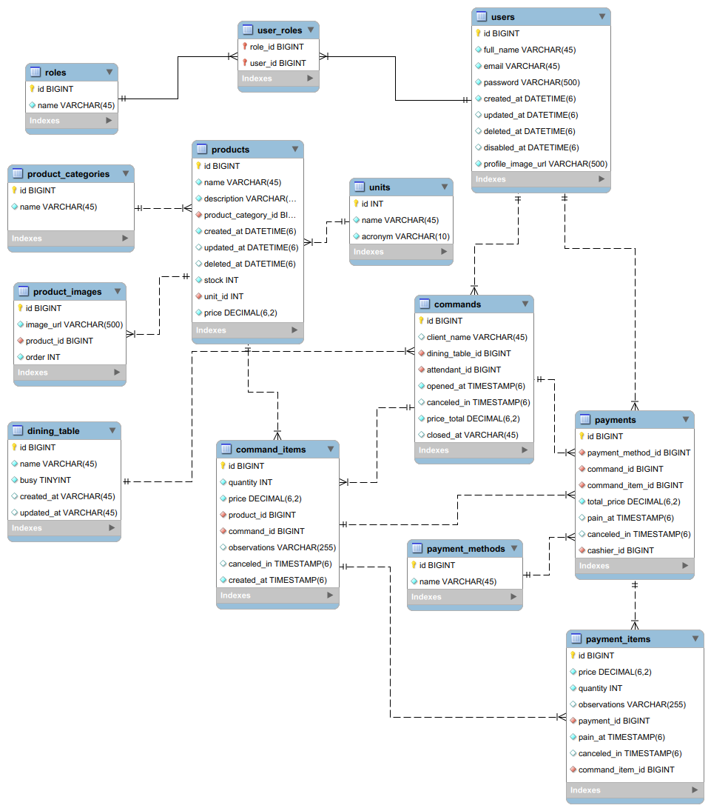

## Plataforma SaaS que gerencia cafeterias.

### Frontend
- Angular 17 (usando modulos)

### Backend
- Spring Boot 3.4
- Flyway

### Database
- Mysql

### Infra
- Docker
- Docker-compose

### Arquitetura de backend
Controller -> Dto -> Service -> Entity -> Banco de dados 

Banco de dados -> Entity -> Service -> Dto -> Controller

### Schema do banco de dados
